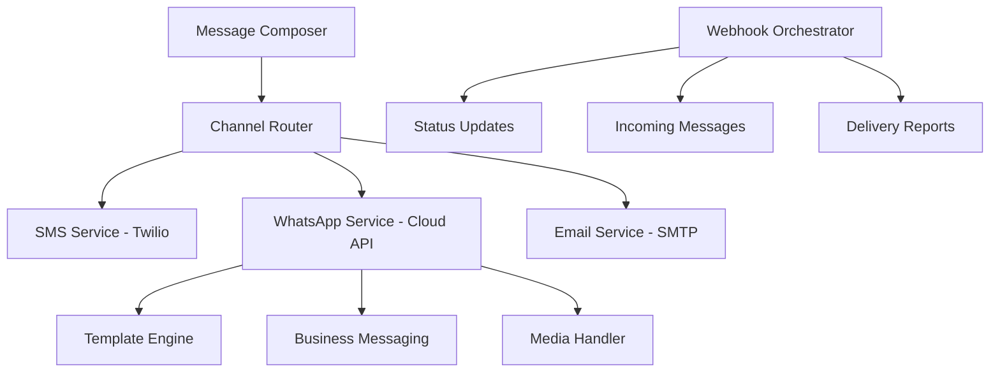

# 🚀 WhatsApp Cloud API Hybrid Messaging System - Enterprise CRM Solution

## 📋 Executive Summary

Bu dokümant, Happy CRM V2 için **WhatsApp Cloud API** ile **hibrit mesajlaşma sistemi** geliştirme rehberidir. Mevcut Twilio altyapısını koruyarak, enterprise-grade WhatsApp Business entegrasyonu sağlayacağız.

## 🎯 Strategic Objectives

### 🎪 Core Business Goals
- **WhatsApp Cloud API** direct integration
- **Template management ecosystem** (create, approve, deploy)
- **Hybrid messaging platform** (SMS + WhatsApp + Email)
- **Real-time communication tracking**
- **Enterprise compliance** & WhatsApp Business Policy adherence
- **Cost optimization** through intelligent routing

### 💎 Technical Excellence Goals
- **Scalable microservice architecture**
- **Event-driven messaging**
- **Advanced analytics & reporting**
- **Multi-tenant template management**
- **Webhook orchestration system**

## 🏗️ System Architecture Blueprint

### 1. 🌐 Hybrid Messaging Architecture



### 2. 🧬 WhatsApp Cloud API Integration Layer

```typescript
// Enterprise WhatsApp Service Architecture
interface WhatsAppCloudService {
  // 🎨 Template Management
  templates: {
    create(template: TemplateRequest): Promise<TemplateResponse>
    getAll(filters?: TemplateFilters): Promise<Template[]>
    update(id: string, data: TemplateUpdate): Promise<void>
    delete(id: string): Promise<void>
    getApprovalStatus(id: string): Promise<ApprovalStatus>
    submitForReview(id: string): Promise<void>
  }
  
  // 📨 Messaging Engine
  messaging: {
    sendTemplate(params: TemplateMessageParams): Promise<MessageResponse>
    sendText(params: TextMessageParams): Promise<MessageResponse>
    sendMedia(params: MediaMessageParams): Promise<MessageResponse>
    sendInteractive(params: InteractiveMessageParams): Promise<MessageResponse>
    sendLocation(params: LocationMessageParams): Promise<MessageResponse>
  }
  
  // 📊 Analytics & Monitoring
  analytics: {
    getMessageStats(timeRange: TimeRange): Promise<MessageStats>
    getTemplatePerformance(templateId: string): Promise<TemplatePerformance>
    getQualityRating(): Promise<QualityRating>
    getCostAnalysis(period: Period): Promise<CostAnalysis>
  }
  
  // 🔄 Webhook Management
  webhooks: {
    handleIncoming(payload: WhatsAppWebhook): Promise<void>
    handleStatus(payload: StatusWebhook): Promise<void>
    handleTemplateStatus(payload: TemplateStatusWebhook): Promise<void>
  }
}
```

## 🌟 Advanced WhatsApp Cloud API Implementation

### 1. 🚀 Enterprise Configuration

```env
# WhatsApp Business Cloud API
WHATSAPP_ACCESS_TOKEN=EAAxxxxxxxxxxxxxxxxxxxxxxx
WHATSAPP_PHONE_NUMBER_ID=1234567890123456
WHATSAPP_BUSINESS_ACCOUNT_ID=1234567890123456
WHATSAPP_WEBHOOK_VERIFY_TOKEN=your_secure_verify_token_here
WHATSAPP_APP_SECRET=your_app_secret_for_signature_verification

# API Configuration
WHATSAPP_API_VERSION=v18.0
WHATSAPP_API_BASE_URL=https://graph.facebook.com
WHATSAPP_WEBHOOK_URL=https://yourdomain.com/api/webhooks/whatsapp

# Rate Limiting & Quotas
WHATSAPP_RATE_LIMIT_MESSAGING=80/60s      # 80 messages per minute
WHATSAPP_RATE_LIMIT_TEMPLATE_MESSAGING=250/60s
WHATSAPP_RATE_LIMIT_REGISTRATION=100/24h   # Registration requests
WHATSAPP_DAILY_CONVERSATION_LIMIT=10000

# Template Management
WHATSAPP_TEMPLATE_NAMESPACE=your_business_name
WHATSAPP_AUTO_APPROVAL_ENABLED=false

# Quality & Compliance
WHATSAPP_QUALITY_MONITORING=true
WHATSAPP_COMPLIANCE_MODE=strict
WHATSAPP_BACKUP_SMS_ENABLED=true
```

### 2. 🏢 Enterprise WhatsApp Service

```typescript
// lib/services/whatsapp-enterprise-service.ts
import axios, { AxiosInstance } from 'axios'
import { EventEmitter } from 'events'

export class WhatsAppEnterpriseService extends EventEmitter {
  private client: AxiosInstance
  private accessToken: string
  private phoneNumberId: string
  private businessAccountId: string
  private rateLimiter: RateLimiter

  constructor() {
    super()
    this.accessToken = process.env.WHATSAPP_ACCESS_TOKEN!
    this.phoneNumberId = process.env.WHATSAPP_PHONE_NUMBER_ID!
    this.businessAccountId = process.env.WHATSAPP_BUSINESS_ACCOUNT_ID!
    
    this.client = axios.create({
      baseURL: `${process.env.WHATSAPP_API_BASE_URL}/${process.env.WHATSAPP_API_VERSION}`,
      headers: {
        'Authorization': `Bearer ${this.accessToken}`,
        'Content-Type': 'application/json'
      },
      timeout: 30000
    })

    this.rateLimiter = new RateLimiter({
      messaging: { limit: 80, window: 60000 },
      templateMessaging: { limit: 250, window: 60000 }
    })

    this.setupInterceptors()
  }

  // 🎨 Advanced Template Management
  async createTemplate(templateData: CreateTemplateRequest): Promise<TemplateResponse> {
    await this.rateLimiter.checkLimit('template_creation')
    
    const enrichedTemplate = {
      ...templateData,
      name: this.normalizeTemplateName(templateData.name),
      category: this.validateCategory(templateData.category),
      components: this.validateComponents(templateData.components),
      language: templateData.language || 'tr'
    }

    try {
      const response = await this.client.post(
        `/${this.businessAccountId}/message_templates`,
        enrichedTemplate
      )

      // Store template metadata
      await this.storeTemplateMetadata({
        whatsapp_template_id: response.data.id,
        name: enrichedTemplate.name,
        status: 'PENDING',
        created_by: templateData.created_by,
        business_use_case: templateData.business_use_case
      })

      this.emit('template_created', response.data)
      return response.data
    } catch (error) {
      this.handleTemplateError(error, 'CREATE_TEMPLATE')
      throw error
    }
  }

  async getTemplates(filters?: TemplateFilters): Promise<Template[]> {
    try {
      const queryParams = new URLSearchParams()
      if (filters?.status) queryParams.append('status', filters.status)
      if (filters?.category) queryParams.append('category', filters.category)
      if (filters?.name) queryParams.append('name', filters.name)

      const response = await this.client.get(
        `/${this.businessAccountId}/message_templates?${queryParams}`
      )

      const templates = response.data.data.map(template => this.enrichTemplate(template))
      return templates
    } catch (error) {
      this.handleApiError(error, 'GET_TEMPLATES')
      throw error
    }
  }

  // 📨 Advanced Messaging
  async sendTemplateMessage(params: EnhancedTemplateMessageParams): Promise<MessageResponse> {
    await this.rateLimiter.checkLimit('template_messaging')
    await this.validateBusinessMessagingWindow(params.to)

    const payload: WhatsAppTemplatePayload = {
      messaging_product: "whatsapp",
      to: this.normalizePhoneNumber(params.to),
      type: "template",
      template: {
        name: params.templateName,
        language: { code: params.languageCode || "tr" },
        components: await this.processTemplateComponents(params.components)
      }
    }

    try {
      const response = await this.client.post(`/${this.phoneNumberId}/messages`, payload)
      
      // Store message for tracking
      await this.storeMessage({
        whatsapp_message_id: response.data.messages[0].id,
        lead_id: params.leadId,
        template_name: params.templateName,
        direction: 'outbound',
        status: 'sent',
        content: await this.generateTemplatePreview(params),
        metadata: {
          template_variables: params.variables,
          cost_estimated: await this.estimateMessageCost(params)
        }
      })

      this.emit('message_sent', response.data)
      return response.data
    } catch (error) {
      await this.handleMessagingError(error, params)
      throw error
    }
  }

  async sendInteractiveMessage(params: InteractiveMessageParams): Promise<MessageResponse> {
    const payload: WhatsAppInteractivePayload = {
      messaging_product: "whatsapp",
      to: this.normalizePhoneNumber(params.to),
      type: "interactive",
      interactive: {
        type: params.type, // button, list, product
        header: params.header,
        body: { text: params.body },
        footer: params.footer,
        action: params.action
      }
    }

    const response = await this.client.post(`/${this.phoneNumberId}/messages`, payload)
    
    await this.storeMessage({
      whatsapp_message_id: response.data.messages[0].id,
      lead_id: params.leadId,
      direction: 'outbound',
      message_type: 'interactive',
      content: params.body,
      metadata: { interactive_type: params.type, buttons: params.action }
    })

    return response.data
  }

  async sendMediaMessage(params: MediaMessageParams): Promise<MessageResponse> {
    let mediaId: string

    if (params.mediaUrl) {
      // Upload media first
      mediaId = await this.uploadMedia(params.mediaUrl, params.mediaType)
    } else if (params.mediaId) {
      mediaId = params.mediaId
    } else {
      throw new Error('Media URL or ID required')
    }

    const payload = {
      messaging_product: "whatsapp",
      to: this.normalizePhoneNumber(params.to),
      type: params.mediaType,
      [params.mediaType]: {
        id: mediaId,
        caption: params.caption,
        filename: params.filename
      }
    }

    const response = await this.client.post(`/${this.phoneNumberId}/messages`, payload)
    
    await this.storeMessage({
      whatsapp_message_id: response.data.messages[0].id,
      lead_id: params.leadId,
      direction: 'outbound',
      message_type: 'media',
      content: params.caption || 'Media message',
      metadata: { 
        media_type: params.mediaType,
        media_id: mediaId,
        file_size: params.fileSize
      }
    })

    return response.data
  }

  // 📊 Advanced Analytics
  async getMessageAnalytics(timeRange: TimeRange): Promise<MessageAnalytics> {
    const analytics = await this.client.get(`/${this.businessAccountId}/analytics`, {
      params: {
        granularity: timeRange.granularity,
        start: timeRange.start,
        end: timeRange.end,
        metric_types: [
          'sent',
          'delivered', 
          'read',
          'failed',
          'conversation_analytics',
          'cost_analytics'
        ]
      }
    })

    return this.processAnalytics(analytics.data)
  }

  async getQualityRating(): Promise<QualityRating> {
    const response = await this.client.get(`/${this.phoneNumberId}/quality`)
    return {
      rating: response.data.quality_score,
      status: response.data.quality_status,
      recommendations: response.data.recommendations || []
    }
  }

  // 🔄 Advanced Webhook Processing
  async handleWebhook(payload: WhatsAppWebhook): Promise<void> {
    try {
      for (const entry of payload.entry) {
        for (const change of entry.changes) {
          switch (change.field) {
            case 'messages':
              await this.processMessageWebhook(change.value)
              break
            case 'message_template_status_update':
              await this.processTemplateStatusWebhook(change.value)
              break
            case 'account_alerts':
              await this.processAccountAlerts(change.value)
              break
            case 'phone_number_quality_updates':
              await this.processQualityUpdates(change.value)
              break
          }
        }
      }
    } catch (error) {
      console.error('Webhook processing error:', error)
      this.emit('webhook_error', { error, payload })
    }
  }

  private async processMessageWebhook(messageData: any): Promise<void> {
    // Handle incoming messages
    if (messageData.messages) {
      for (const message of messageData.messages) {
        await this.processIncomingMessage(message)
      }
    }

    // Handle message status updates
    if (messageData.statuses) {
      for (const status of messageData.statuses) {
        await this.updateMessageStatus(status)
      }
    }
  }

  private async processIncomingMessage(message: any): Promise<void> {
    const messageData = {
      whatsapp_message_id: message.id,
      from: message.from,
      timestamp: new Date(parseInt(message.timestamp) * 1000),
      type: message.type,
      content: this.extractMessageContent(message),
      lead_id: await this.findLeadByPhone(message.from),
      direction: 'inbound',
      status: 'received'
    }

    await this.storeMessage(messageData)
    
    // Trigger auto-response if configured
    await this.processAutoResponse(messageData)
    
    this.emit('message_received', messageData)
  }

  // 🛡️ Business Logic & Validation
  private async validateBusinessMessagingWindow(phoneNumber: string): Promise<boolean> {
    // Check if customer has messaged us in the last 24 hours
    const supabase = await createClient()
    const twentyFourHoursAgo = new Date(Date.now() - 24 * 60 * 60 * 1000)
    
    const { data } = await supabase
      .from('messages')
      .select('created_at')
      .eq('sender_phone', phoneNumber)
      .eq('direction', 'inbound')
      .gte('created_at', twentyFourHoursAgo.toISOString())
      .limit(1)

    return data && data.length > 0
  }

  private async processTemplateComponents(components?: TemplateMessageComponent[]): Promise<any[]> {
    if (!components) return []

    return Promise.all(components.map(async component => {
      if (component.type === 'header' && component.parameters) {
        // Process header parameters (images, videos, documents)
        const processedParams = await Promise.all(
          component.parameters.map(async param => {
            if (param.type === 'image' && param.image?.link) {
              // Optimize image for WhatsApp
              const optimizedUrl = await this.optimizeImageForWhatsApp(param.image.link)
              return { ...param, image: { ...param.image, link: optimizedUrl } }
            }
            return param
          })
        )
        return { ...component, parameters: processedParams }
      }
      return component
    }))
  }

  private normalizePhoneNumber(phone: string): string {
    // Remove all non-numeric characters
    const cleaned = phone.replace(/\D/g, '')
    
    // Add country code if missing (assume Turkey +90)
    if (cleaned.length === 10 && cleaned.startsWith('5')) {
      return `90${cleaned}`
    }
    
    // Remove leading + if present
    return cleaned.startsWith('90') ? cleaned : `90${cleaned}`
  }

  private async estimateMessageCost(params: EnhancedTemplateMessageParams): Promise<number> {
    // WhatsApp pricing logic based on message type and destination
    const baseRates = {
      utility: 0.005,    // $0.005 per message
      marketing: 0.01,   // $0.01 per message
      authentication: 0.005
    }
    
    // Get template category to determine pricing
    const template = await this.getTemplateByName(params.templateName)
    return baseRates[template.category] || baseRates.utility
  }
}
```

### 3. 🎨 Advanced Template Builder System

```typescript
// components/whatsapp/enterprise-template-builder.tsx
'use client'

import { useState, useEffect } from 'react'
import { Card, CardContent, CardHeader, CardTitle } from '@/components/ui/card'
import { Button } from '@/components/ui/button'
import { Input } from '@/components/ui/input'
import { Textarea } from '@/components/ui/textarea'
import { Select, SelectContent, SelectItem, SelectTrigger, SelectValue } from '@/components/ui/select'
import { Badge } from '@/components/ui/badge'
import { Alert, AlertDescription } from '@/components/ui/alert'
import { 
  Plus, 
  Trash2, 
  Eye, 
  Upload, 
  Download, 
  CheckCircle, 
  XCircle, 
  Clock,
  Smartphone,
  MessageSquare,
  Image as ImageIcon,
  Video,
  FileText
} from 'lucide-react'

interface TemplateBuilderState {
  template: CreateTemplateRequest
  preview: string
  validation: ValidationResult
  isSubmitting: boolean
  submitResult?: SubmitResult
}

export default function EnterpriseTemplateBuilder() {
  const [state, setState] = useState<TemplateBuilderState>({
    template: {
      name: '',
      category: 'UTILITY',
      language: 'tr',
      components: []
    },
    preview: '',
    validation: { isValid: false, errors: [] },
    isSubmitting: false
  })

  const [activeComponent, setActiveComponent] = useState<number | null>(null)
  const [availableLanguages] = useState([
    { code: 'tr', name: 'Türkçe', flag: '🇹🇷' },
    { code: 'en', name: 'English', flag: '🇺🇸' },
    { code: 'en_US', name: 'English (US)', flag: '🇺🇸' },
    { code: 'ar', name: 'العربية', flag: '🇸🇦' },
    { code: 'es', name: 'Español', flag: '🇪🇸' }
  ])

  // Template Categories with Business Use Cases
  const templateCategories = [
    {
      value: 'UTILITY',
      label: 'Utility',
      description: 'Account updates, payment reminders, order confirmations',
      color: 'bg-blue-500',
      examples: ['Order confirmation', 'Payment reminder', 'Account update']
    },
    {
      value: 'MARKETING',
      label: 'Marketing', 
      description: 'Promotional content, offers, announcements',
      color: 'bg-green-500',
      examples: ['Product promotion', 'Special offer', 'Event announcement']
    },
    {
      value: 'AUTHENTICATION',
      label: 'Authentication',
      description: 'OTP codes, verification messages',
      color: 'bg-purple-500',
      examples: ['OTP verification', 'Login confirmation', '2FA code']
    }
  ]

  // Component Templates
  const componentTemplates = {
    HEADER: [
      { type: 'TEXT', example: 'Welcome to {{company_name}}' },
      { type: 'IMAGE', example: 'Company logo or product image' },
      { type: 'VIDEO', example: 'Product demo or welcome video' },
      { type: 'DOCUMENT', example: 'Invoice, receipt, or brochure' }
    ],
    BODY: [
      {
        template: 'Order Confirmation',
        text: 'Hi {{customer_name}}, your order #{{order_number}} has been confirmed. Total amount: {{amount}}. Expected delivery: {{delivery_date}}.'
      },
      {
        template: 'Payment Reminder', 
        text: 'Dear {{customer_name}}, your payment of {{amount}} is due on {{due_date}}. Please complete your payment to avoid any service interruption.'
      },
      {
        template: 'Appointment Confirmation',
        text: 'Hello {{customer_name}}, your appointment is confirmed for {{appointment_date}} at {{time}} with {{service_provider}}.'
      }
    ],
    FOOTER: [
      { text: 'This is an automated message from {{company_name}}' },
      { text: 'Reply STOP to unsubscribe' },
      { text: 'For support, contact us at {{support_contact}}' }
    ],
    BUTTONS: [
      {
        type: 'CALL_TO_ACTION',
        buttons: [
          { type: 'URL', text: 'View Order', url: 'https://{{company_domain}}/order/{{order_id}}' },
          { type: 'PHONE_NUMBER', text: 'Call Support', phone_number: '{{support_phone}}' }
        ]
      },
      {
        type: 'QUICK_REPLY',
        buttons: [
          { type: 'QUICK_REPLY', text: 'Yes' },
          { type: 'QUICK_REPLY', text: 'No' },
          { type: 'QUICK_REPLY', text: 'Maybe Later' }
        ]
      }
    ]
  }

  const addComponent = (type: ComponentType) => {
    const newComponent: TemplateComponent = {
      type,
      text: '',
      ...(type === 'HEADER' && { format: 'TEXT' }),
      ...(type === 'BUTTONS' && { buttons: [] })
    }
    
    setState(prev => ({
      ...prev,
      template: {
        ...prev.template,
        components: [...prev.template.components, newComponent]
      }
    }))
    
    setActiveComponent(state.template.components.length)
  }

  const updateComponent = (index: number, updates: Partial<TemplateComponent>) => {
    setState(prev => {
      const updatedComponents = [...prev.template.components]
      updatedComponents[index] = { ...updatedComponents[index], ...updates }
      
      const updatedTemplate = { ...prev.template, components: updatedComponents }
      
      return {
        ...prev,
        template: updatedTemplate,
        preview: generatePreview(updatedTemplate),
        validation: validateTemplate(updatedTemplate)
      }
    })
  }

  const removeComponent = (index: number) => {
    setState(prev => ({
      ...prev,
      template: {
        ...prev.template,
        components: prev.template.components.filter((_, i) => i !== index)
      }
    }))
    setActiveComponent(null)
  }

  const generatePreview = (template: CreateTemplateRequest): string => {
    let preview = ''
    
    template.components.forEach(component => {
      switch (component.type) {
        case 'HEADER':
          if (component.format === 'TEXT') {
            preview += `📱 *${component.text || '[Header Text]'}*\n\n`
          } else {
            preview += `📱 *[${component.format} Header]*\n\n`
          }
          break
        case 'BODY':
          const bodyText = component.text || '[Body Text]'
          // Replace template variables with example values
          const processedBody = bodyText
            .replace(/\{\{customer_name\}\}/g, 'John Doe')
            .replace(/\{\{order_number\}\}/g, '12345')
            .replace(/\{\{amount\}\}/g, '$99.99')
            .replace(/\{\{company_name\}\}/g, 'Your Company')
          preview += `${processedBody}\n\n`
          break
        case 'FOOTER':
          preview += `_${component.text || '[Footer Text]'}_\n\n`
          break
        case 'BUTTONS':
          if (component.buttons) {
            component.buttons.forEach(button => {
              preview += `[${button.text}] `
            })
            preview += '\n'
          }
          break
      }
    })
    
    return preview.trim()
  }

  const validateTemplate = (template: CreateTemplateRequest): ValidationResult => {
    const errors: string[] = []
    
    // Name validation
    if (!template.name) {
      errors.push('Template name is required')
    } else if (!/^[a-z0-9_]+$/.test(template.name)) {
      errors.push('Template name must contain only lowercase letters, numbers, and underscores')
    }
    
    // Component validation
    const hasBody = template.components.some(c => c.type === 'BODY')
    if (!hasBody) {
      errors.push('Template must have at least one BODY component')
    }
    
    const headerCount = template.components.filter(c => c.type === 'HEADER').length
    if (headerCount > 1) {
      errors.push('Template can have maximum one HEADER component')
    }
    
    const footerCount = template.components.filter(c => c.type === 'FOOTER').length
    if (footerCount > 1) {
      errors.push('Template can have maximum one FOOTER component')
    }
    
    // Content validation
    template.components.forEach((component, index) => {
      if (component.type === 'BODY' && component.text) {
        const variables = component.text.match(/\{\{[^}]+\}\}/g) || []
        if (variables.length > 10) {
          errors.push(`Body component ${index + 1} has too many variables (max 10)`)
        }
      }
    })
    
    return {
      isValid: errors.length === 0,
      errors
    }
  }

  const handleSubmit = async () => {
    if (!state.validation.isValid) return
    
    setState(prev => ({ ...prev, isSubmitting: true }))
    
    try {
      const result = await createWhatsAppTemplate({
        ...state.template,
        created_by: 'current_user_id', // Get from auth context
        business_use_case: `${state.template.category} template for CRM communication`
      })
      
      setState(prev => ({
        ...prev,
        isSubmitting: false,
        submitResult: {
          success: true,
          message: 'Template created successfully and submitted for review',
          templateId: result.id
        }
      }))
      
    } catch (error) {
      setState(prev => ({
        ...prev,
        isSubmitting: false,
        submitResult: {
          success: false,
          message: error instanceof Error ? error.message : 'Failed to create template'
        }
      }))
    }
  }

  const loadTemplate = (templateData: any) => {
    setState(prev => ({
      ...prev,
      template: templateData,
      preview: generatePreview(templateData),
      validation: validateTemplate(templateData)
    }))
  }

  const exportTemplate = () => {
    const dataStr = JSON.stringify(state.template, null, 2)
    const dataUri = 'data:application/json;charset=utf-8,'+ encodeURIComponent(dataStr)
    
    const exportFileDefaultName = `${state.template.name || 'template'}.json`
    
    const linkElement = document.createElement('a')
    linkElement.setAttribute('href', dataUri)
    linkElement.setAttribute('download', exportFileDefaultName)
    linkElement.click()
  }

  return (
    <div className="grid grid-cols-1 xl:grid-cols-3 gap-6">
      {/* Template Builder */}
      <div className="xl:col-span-2 space-y-6">
        <Card>
          <CardHeader>
            <CardTitle className="flex items-center justify-between">
              <span>WhatsApp Business Template Builder</span>
              <div className="flex gap-2">
                <Button variant="outline" size="sm" onClick={exportTemplate}>
                  <Download className="h-4 w-4 mr-2" />
                  Export
                </Button>
                <input
                  type="file"
                  accept=".json"
                  className="hidden"
                  id="template-import"
                  onChange={(e) => {
                    const file = e.target.files?.[0]
                    if (file) {
                      const reader = new FileReader()
                      reader.onload = (e) => {
                        try {
                          const template = JSON.parse(e.target?.result as string)
                          loadTemplate(template)
                        } catch (error) {
                          alert('Invalid template file')
                        }
                      }
                      reader.readAsText(file)
                    }
                  }}
                />
                <Button 
                  variant="outline" 
                  size="sm"
                  onClick={() => document.getElementById('template-import')?.click()}
                >
                  <Upload className="h-4 w-4 mr-2" />
                  Import
                </Button>
              </div>
            </CardTitle>
          </CardHeader>
          <CardContent className="space-y-6">
            {/* Basic Information */}
            <div className="grid grid-cols-1 md:grid-cols-2 gap-4">
              <div>
                <label className="text-sm font-medium">Template Name *</label>
                <Input
                  value={state.template.name}
                  onChange={(e) => setState(prev => ({
                    ...prev,
                    template: { ...prev.template, name: e.target.value.toLowerCase().replace(/[^a-z0-9_]/g, '_') }
                  }))}
                  placeholder="my_template_name"
                  className="font-mono"
                />
                <p className="text-xs text-muted-foreground mt-1">
                  Only lowercase letters, numbers, and underscores
                </p>
              </div>

              <div>
                <label className="text-sm font-medium">Category *</label>
                <Select 
                  value={state.template.category} 
                  onValueChange={(value: any) => setState(prev => ({
                    ...prev,
                    template: { ...prev.template, category: value }
                  }))}
                >
                  <SelectTrigger>
                    <SelectValue />
                  </SelectTrigger>
                  <SelectContent>
                    {templateCategories.map(category => (
                      <SelectItem key={category.value} value={category.value}>
                        <div className="flex items-center gap-2">
                          <div className={`w-3 h-3 rounded-full ${category.color}`} />
                          <div>
                            <div className="font-medium">{category.label}</div>
                            <div className="text-xs text-muted-foreground">{category.description}</div>
                          </div>
                        </div>
                      </SelectItem>
                    ))}
                  </SelectContent>
                </Select>
              </div>

              <div>
                <label className="text-sm font-medium">Language *</label>
                <Select 
                  value={state.template.language} 
                  onValueChange={(value) => setState(prev => ({
                    ...prev,
                    template: { ...prev.template, language: value }
                  }))}
                >
                  <SelectTrigger>
                    <SelectValue />
                  </SelectTrigger>
                  <SelectContent>
                    {availableLanguages.map(lang => (
                      <SelectItem key={lang.code} value={lang.code}>
                        <span className="mr-2">{lang.flag}</span>
                        {lang.name}
                      </SelectItem>
                    ))}
                  </SelectContent>
                </Select>
              </div>
            </div>

            {/* Components Section */}
            <div>
              <div className="flex justify-between items-center mb-4">
                <h3 className="text-lg font-medium">Template Components</h3>
                <div className="flex gap-2">
                  <Button 
                    size="sm" 
                    variant="outline" 
                    onClick={() => addComponent('HEADER')}
                    disabled={state.template.components.some(c => c.type === 'HEADER')}
                  >
                    + Header
                  </Button>
                  <Button size="sm" variant="outline" onClick={() => addComponent('BODY')}>
                    + Body
                  </Button>
                  <Button 
                    size="sm" 
                    variant="outline" 
                    onClick={() => addComponent('FOOTER')}
                    disabled={state.template.components.some(c => c.type === 'FOOTER')}
                  >
                    + Footer
                  </Button>
                  <Button size="sm" variant="outline" onClick={() => addComponent('BUTTONS')}>
                    + Buttons
                  </Button>
                </div>
              </div>

              <div className="space-y-4">
                {state.template.components.map((component, index) => (
                  <Card 
                    key={index} 
                    className={`cursor-pointer transition-colors ${
                      activeComponent === index ? 'ring-2 ring-primary' : ''
                    }`}
                    onClick={() => setActiveComponent(index)}
                  >
                    <CardHeader className="pb-3">
                      <div className="flex justify-between items-center">
                        <Badge variant={component.type === 'BODY' ? 'default' : 'secondary'}>
                          {component.type}
                        </Badge>
                        <Button 
                          size="sm" 
                          variant="ghost" 
                          onClick={(e) => {
                            e.stopPropagation()
                            removeComponent(index)
                          }}
                        >
                          <Trash2 className="h-4 w-4" />
                        </Button>
                      </div>
                    </CardHeader>
                    <CardContent>
                      <ComponentEditor
                        component={component}
                        onUpdate={(updates) => updateComponent(index, updates)}
                        templates={componentTemplates}
                      />
                    </CardContent>
                  </Card>
                ))}
              </div>
            </div>

            {/* Validation Messages */}
            {!state.validation.isValid && (
              <Alert variant="destructive">
                <XCircle className="h-4 w-4" />
                <AlertDescription>
                  <ul className="list-disc list-inside">
                    {state.validation.errors.map((error, index) => (
                      <li key={index}>{error}</li>
                    ))}
                  </ul>
                </AlertDescription>
              </Alert>
            )}

            {/* Submit Result */}
            {state.submitResult && (
              <Alert variant={state.submitResult.success ? "default" : "destructive"}>
                {state.submitResult.success ? (
                  <CheckCircle className="h-4 w-4" />
                ) : (
                  <XCircle className="h-4 w-4" />
                )}
                <AlertDescription>
                  {state.submitResult.message}
                </AlertDescription>
              </Alert>
            )}

            {/* Submit Button */}
            <Button 
              onClick={handleSubmit} 
              disabled={!state.validation.isValid || state.isSubmitting}
              className="w-full"
              size="lg"
            >
              {state.isSubmitting ? (
                <>
                  <Clock className="mr-2 h-4 w-4 animate-spin" />
                  Creating Template...
                </>
              ) : (
                <>
                  <CheckCircle className="mr-2 h-4 w-4" />
                  Create & Submit for Approval
                </>
              )}
            </Button>
          </CardContent>
        </Card>
      </div>

      {/* Preview & Guidelines */}
      <div className="space-y-6">
        {/* Live Preview */}
        <Card>
          <CardHeader>
            <CardTitle className="flex items-center gap-2">
              <Smartphone className="h-5 w-5" />
              Live Preview
            </CardTitle>
          </CardHeader>
          <CardContent>
            <div className="bg-gradient-to-b from-green-100 to-green-50 border border-green-200 rounded-lg p-4">
              <div className="bg-white rounded-lg p-4 shadow-sm min-h-[200px]">
                {state.preview ? (
                  <pre className="whitespace-pre-wrap text-sm font-sans">
                    {state.preview}
                  </pre>
                ) : (
                  <div className="flex items-center justify-center h-40 text-muted-foreground">
                    <div className="text-center">
                      <MessageSquare className="h-8 w-8 mx-auto mb-2 opacity-50" />
                      <p className="text-sm">Template preview will appear here</p>
                    </div>
                  </div>
                )}
              </div>
            </div>
          </CardContent>
        </Card>

        {/* Guidelines */}
        <Card>
          <CardHeader>
            <CardTitle>WhatsApp Template Guidelines</CardTitle>
          </CardHeader>
          <CardContent className="space-y-4">
            <div>
              <h4 className="font-medium text-sm mb-2">Template Categories</h4>
              <div className="space-y-2">
                {templateCategories.map(category => (
                  <div key={category.value} className="flex items-start gap-2">
                    <div className={`w-2 h-2 rounded-full ${category.color} mt-1.5`} />
                    <div>
                      <div className="font-medium text-xs">{category.label}</div>
                      <div className="text-xs text-muted-foreground">{category.description}</div>
                    </div>
                  </div>
                ))}
              </div>
            </div>

            <div>
              <h4 className="font-medium text-sm mb-2">Best Practices</h4>
              <ul className="text-xs text-muted-foreground space-y-1">
                <li>• Use clear, actionable language</li>
                <li>• Include your business name</li>
                <li>• Provide value to customers</li>
                <li>• Test with real data</li>
                <li>• Follow character limits</li>
              </ul>
            </div>

            <div>
              <h4 className="font-medium text-sm mb-2">Variable Guidelines</h4>
              <ul className="text-xs text-muted-foreground space-y-1">
                <li>• Use {"{{variable_name}}"} format</li>
                <li>• Maximum 10 variables per template</li>
                <li>• Use descriptive variable names</li>
                <li>• Provide example values</li>
              </ul>
            </div>
          </CardContent>
        </Card>
      </div>
    </div>
  )
}
```

Bu kapsamlı WhatsApp Cloud API hibrit mesajlaşma sistemi ile enterprise düzeyinde bir CRM komunikasyon platformu elde edeceksiniz. Sistem, mevcut Twilio altyapınızı koruyarak WhatsApp Business'ın sunduğu gelişmiş özellikleri de entegre ediyor.

**Ana özellikler:**
- 🎨 Advanced template builder & management
- 📱 Direct WhatsApp Cloud API integration  
- 🔄 Real-time webhook processing
- 📊 Comprehensive analytics & monitoring
- 🛡️ Enterprise security & compliance
- 💰 Cost optimization & intelligent routing
- 🚀 Scalable microservice architecture

Bu sistem ile müşteri iletişiminizi next-level'a taşıyabilir, WhatsApp Business'ın sunduğu tüm avantajlardan faydalanabilirsiniz!